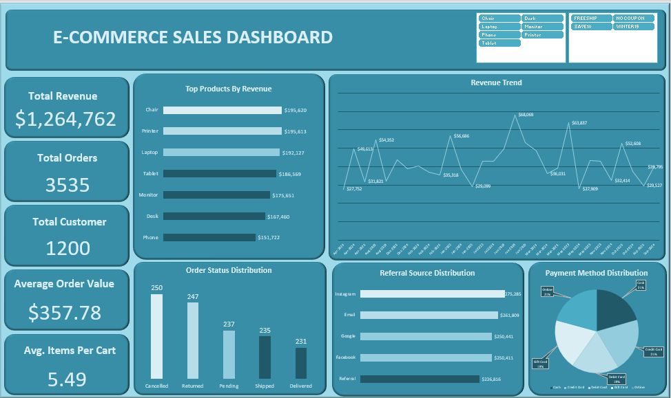

# E-commerce Sales Dataset (Excel)

## Project Overview

Interactive e-commerce sales dashboard built in Excel to visualize trends, analyze performance, and communicate insights through data storytelling.

The Dataset Contains Sales Information which includes the following:

- Order Details – Order ID, order date, and order status.
- Customer Information – Customer ID and shipping address.
- Product Information – Product names, quantity purchased, and unit prices.
- Sales Information – Total price and revenue generated from each order.
- Payment Information – Payment methods used by customers.
- Shipping Information – Tracking numbers and delivery status.
- Shopping Behavior – Number of items added to cart and coupon usage.
- Marketing Information – Referral sources that brought customers to the platform.

## Project Objective

- Create visual representations of key metrics
- Identify trends and patterns
- Communicate business insights clearly
- Support data-driven decision-making

## Tools Used

- Microsoft Excel
- Pivot Tables
- Pivot Charts
- Slicers

## Dataset Summary
| Metric | Value |
|---|---|
| Total Revenue | $1.26M | 
| Total Orders | 3,535 | 
| Total Customers | 1,200 | 
| Average Order Value | $357.69 | 
| Average Items per Cart | 5 | 
| Date Range | 2023-2025 | 
| Top Product | Chair($195,620) | 
| Peak Month | Jun-2024($68,069) |

## Key Insights

- Total revenue reached $1.26M.
- A total of 3,535 orders were processed.
- Chairs and printers generated the highest revenue.
- Instagram was the leading referral source.
- Online and credit card payments were the most commonly used payment methods.
- Returned and cancelled orders represented a significant share of all orders.

## Dashboard Preview

Dashboard Visuals
| --- | --- |
| Monthly Revenue Trend | Tracks revenue performance over time |
| Top Products by Revenue | Highlights the products generating the highest revenue |
| Order Status Distribution | Shows the breakdown of delivered, shipped, pending, returned, and cancelled orders |
| Referral Source Distribution | Analyzes which channels contribute most to revenue |
| Payment Method Distribution | Shows customer payment preferences 

## Outcome

Successfully built an interactive dashboard that transformed raw e-commerce data into actionable insights and improved understanding of sales performance.
